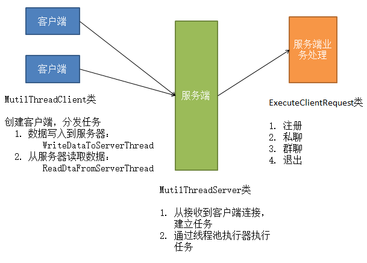

#### 项目概述
支持单聊、群聊功能的聊天室
#### 功能描述
注册、私聊、群聊、退出
#### 使用技术
* Socket技术
* JDBC编程
* 多线程
* Java基础
#### 项目实现

* 客户端：采用读写线程分别处理交互与服务器户数接收
* 服务端：采用线程池调度执行服务器与客户端的业务处理逻辑
#### 测试结果
* 平均响应时间：100ms
* 支持同时在线用户数：1000~1500